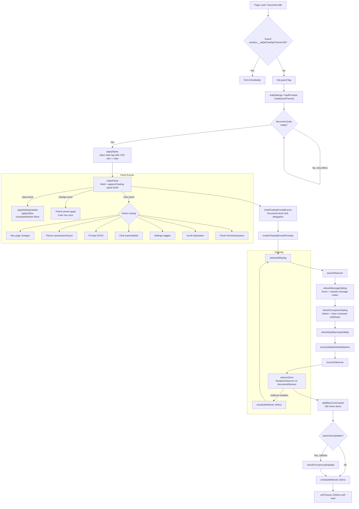
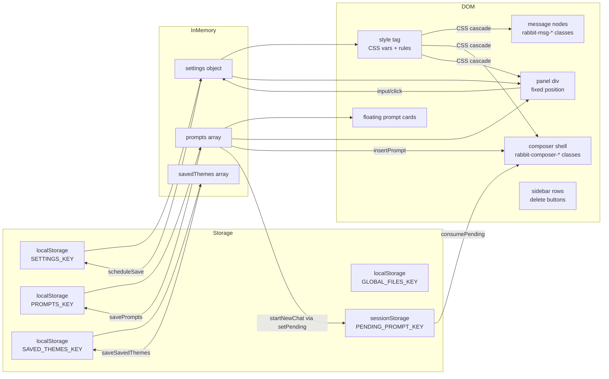

# GPT-Unleashed v2.8.26 — Advanced Technical Blueprint & Replication Dossier

**Script Name:** GPT-Unleashed  
**Version Analyzed:** 2.8.26  
**Lines of Source:** 5,549  
**Author Namespace:** `https://openai.com/` (userscript namespace, not authorship claim)  
**Guard Key:** `window.__rabbitChatGptThemeV28`

---

## 1. Purpose and Scope

### What the Script Does

GPT-Unleashed is a comprehensive cosmetic and utility overlay for ChatGPT's web interface. It operates entirely client-side, injecting CSS and DOM manipulations to replace ChatGPT's native visual design with a fully customizable theming system, while adding a suite of productivity tools around prompt management, chat export, and sidebar management.

The script has two primary concern areas:

1. **Visual theming engine** — Overrides background colors, message bubble styles, embedded code block colors, the composer text area, and sidebar — all via CSS custom properties and dynamically managed class names applied at the DOM element level.
2. **Prompt and chat management** — A saved-prompt library with tagging, pinning, floating cards, AI enhancement, and the ability to export or bulk-delete sidebar chats.

### Pages and UI States Targeted

The script targets all pages under `https://chatgpt.com/*` and `https://chat.openai.com/*`. It does not detect or branch on specific page routes. All initialization runs unconditionally, but individual DOM targeting is deferred until a `[data-message-author-role]` element or a composer input is found.

| UI State | Behavior |
|---|---|
| Chat in progress | Themes message bubbles; identifies and classes the composer shell |
| New conversation / home screen | Panel and launcher still present; styling still injected |
| Sidebar open | Sidebar background, text, hover colors applied; delete shortcut buttons injected |
| Any page | Full panel rendered; CSS style tag injected into `<head>` |

### Problem It Solves

ChatGPT's built-in UI has no theme customization, no prompt library, no bulk chat management tools, and no chat export functionality. GPT-Unleashed provides all of these. It is particularly aimed at power users who want a persistent prompt library they can insert into conversations without copying from external notes, and who want control over the exact color palette and typography of the chat interface.

### Before and After Installation

| Aspect | Before | After |
|---|---|---|
| Page colors | ChatGPT default (white/gray) | Fully custom palette (default: deep black + neon green) |
| Message bubbles | Native non-differentiated styling | Distinctly styled user vs. assistant bubbles with custom radius/padding/max-width |
| Sidebar | Default white/gray | Custom background, text, and hover colors |
| Composer area | Default styling | Custom background and text color |
| Code blocks | ChatGPT's built-in dark theme | Custom embed background and text color |
| Bottom-right screen area | Empty | Floating panel launcher icon |
| Sidebar items | No quick-delete | 🗑 delete button injected per chat row |
| Prompt management | None | Full library with tags, pins, AI enhancement, floating cards |
| Chat export | None | Markdown export of current or bulk sidebar chats |
| Bottom of chat | "ChatGPT can make mistakes" warning | Hidden (configurable) |

---

## 2. Feature Inventory

### User-Facing Features

#### 2.1 Theme Editor Panel

A floating, draggable panel (322px wide, fixed position) is the central UI for all settings. It has seven pages:

| Page Key | Label | Content Summary |
|---|---|---|
| `home` | GPT-Unleashed | Navigation grid to all sub-pages; scroll-to-top/bottom launcher buttons |
| `themes` | Themes | Theme preset selector, per-zone color toggle switches, color pickers (19 color keys), save/export/import theme actions |
| `layout` | Layout | Text alignment dropdown; bubble radius/max-width/padding sliders; layout sub-toggles (wheel adjust, track fill, slider skin, advanced controls, embed alignment lock) |
| `font` | Font | Font family text input; per-role font size sliders (user, assistant, sidebar) |
| `prompts` | Prompts | Full prompt library: sections for pinned, user, and AI prompts; per-prompt Insert/New Chat/Favorite/Pin/Review/Expand/Enhance buttons; search bar; import from file/URL; export |
| `settings` | Settings | Feature master toggles, launcher visibility, drag enable, UI opacity, update configuration, script+settings export |
| `ui-theme` | UI Theme | Panel UI colors (background, bubbles, font, outlines, buttons); optional match-to-theme auto-derivation |

#### 2.2 Theme Presets

Nine built-in presets (see table below) plus user-created saved themes stored in `localStorage`. A `<select>` dropdown lists them; choosing one applies all colors immediately and rebuilds the panel.

| Preset ID | Name |
|---|---|
| `builtin-default` | Default Theme |
| `builtin-midnight-oled` | Midnight OLED |
| `builtin-dracula` | Dracula |
| `builtin-nord` | Nord |
| `builtin-github-dark` | GitHub Dark |
| `builtin-solarized-dark` | Solarized Dark |
| `builtin-catppuccin-mocha` | Catppuccin Mocha |
| `builtin-notion-light` | Notion Light |
| `builtin-synthwave-neon` | Synthwave Neon |

#### 2.3 Prompt Library

Prompts are plain text with metadata: `{id, title, text, favorite, pinned, type, createdAt, tags[], expanded}`. The library supports:

- Create, review, delete, favorite, pin, expand/collapse
- Insert into composer directly
- Launch a new chat with the prompt pre-loaded (via `sessionStorage` pending prompt)
- AI enhancement: wraps the prompt text in an instruction to GPT and re-inserts it
- Tag-based filtering (comma-separated tags)
- Import from `.json` or `.txt` file, or from a remote URL
- Export as timestamped `.json`
- Floating pinned prompt cards (draggable, with prev/next/review/unpin actions)
- Prompt Review modal (full-text overlay)
- Composer Prompt Explorer modal (full-screen search/filter dialog accessible from the `+` attach button intercept)

#### 2.4 Sidebar Chat Management

- **Delete button**: 🗑 button injected into every sidebar chat row using `[data-testid*="options"]` detection
- **Bulk delete modal**: Checkbox list of all sidebar chats; select-all/confirm/close; sequential automated deletion with `robustClick` simulation
- **Bulk export modal**: Same checklist UI; fetches each selected chat's HTML via `fetch()` with `credentials: 'include'`, parses it, and downloads a `.md` file per chat
- **Current chat export**: Exports the currently viewed conversation to Markdown using DOM-scraped message content

#### 2.5 Scroll Controls

Two icon buttons in the minimized launcher: scroll chat to top (via `scrollIntoView`) and scroll to bottom (via last `[data-message-author-role]` node).

#### 2.6 Update Checker

Fetches a GitHub Raw URL (configurable in Settings), parses `@version` from the response, and compares against `SCRIPT_VERSION` using semver component comparison. Optionally auto-runs 1800ms after page load.

#### 2.7 GPT Warning Hider

Walks the DOM tree looking for text nodes containing both `"chatgpt can make mistakes"` and `"check important info"`, then hides the parent container with `display: none !important` and a `data-rabbit-warning-hidden="1"` attribute.

#### 2.8 Global Files

A lightweight file attachment store: reads arbitrary files as base64 data URLs and persists them in `localStorage` under `GLOBAL_FILES_KEY`. No injection into ChatGPT's file upload system is performed — this is a reference store only (inferred from lack of active injection code; the file data is stored and listed but not sent anywhere automatically).

### Background and Helper Features

#### 2.9 MutationObserver DOM Watch

Observes `document.documentElement` for `childList` subtree mutations. Any added or removed `HTMLElement` not belonging to the script's own panel schedules a `refreshAllStyling()` call with a 140ms debounce.

#### 2.10 CSS Custom Properties System

All theme values are expressed as CSS custom properties on `:root` and `#rabbit-chatgpt-theme-panel-v28`, then consumed via `var()` references in rule sets. This means changing a color requires only re-writing the style tag, not re-querying elements.

#### 2.11 Deferred Style Tag Self-Healing

A `setTimeout` at 1200ms re-checks for the style tag and panel element and recreates them if missing (SPA navigation can destroy injected nodes).

#### 2.12 Drag and Drop

Three distinct draggable behaviors:
- **Panel header drag** — requires `moveGuiDragEnabled`; saves `panelLeft`/`panelTop` on `mouseup`.
- **Launcher emblem drag** — 160ms hold threshold before drag starts; suppresses the subsequent click event to prevent toggling.
- **Floating prompt card drag** — per-card per-mouse-move listeners that are torn down on `mouseup`.

---

## 3. Architecture and Structure

### File Structure

The entire script is a single self-contained IIFE (Immediately Invoked Function Expression). There is no module system, no external imports beyond the userscript metadata, and no build step visible in the source.

```
GPT-Unleashed-v2_8_user.js
└── IIFE wrapper (function() { 'use strict'; ... })()
    ├── Guard check (window.__rabbitChatGptThemeV28)
    ├── Constants (STORAGE_KEY, PANEL_ID, patterns, icons, defaults, etc.)
    ├── State variables (settings, prompts, savedThemes, timers, observer)
    ├── Utility functions (sanitize*, escape*, clamp*, format*, sleep)
    ├── Persistence layer (load/save Settings, Prompts, SavedThemes, GlobalFiles)
    ├── Theme system (normalize, apply, derive, preset management)
    ├── CSS injection (ensureStyleTag, applyStyles)
    ├── DOM targeting (findBestMessageContent, scoreCandidate, refreshMessageStyling)
    ├── Composer detection (getComposerInputCandidates, findComposerShellForInput)
    ├── Prompt system (normalizePrompt, renderPromptsList, insertPromptIntoComposer, etc.)
    ├── Chat management (getSidebarChatItems, deleteChatFromSidebarItem, export functions)
    ├── Panel construction (makePanel — monolithic HTML template + event binding)
    ├── Panel sub-systems (draggable, page routing, tooltip system, notifications)
    ├── MutationObserver (observeDom, pauseObserver, resumeObserver)
    ├── Update check (checkForUserscriptUpdate)
    ├── GM menu commands (addMenuCommands)
    └── Entry point (init + DOMContentLoaded guard)
```

### Metadata Block Analysis

```javascript
// @name         GPT-Unleashed
// @namespace    https://openai.com/       ← Not affiliated; just a namespace string
// @version      2.8.26
// @match        https://chatgpt.com/*
// @match        https://chat.openai.com/* ← Legacy domain
// @run-at       document-idle             ← Runs after DOMContentLoaded
// @grant        GM_addStyle               ← Declared but NOT used in code (dead grant)
// @grant        GM_registerMenuCommand    ← Used for 4 manager menu items
// @grant        GM_info                   ← Used to read script source for export
```

Note: `GM_addStyle` is declared but never called. All CSS injection is done via `document.createElement('style')` instead. This grant is vestigial.

### Key Constants

| Constant | Value | Purpose |
|---|---|---|
| `SCRIPT_VERSION` | `'2.8.26'` | Used in update comparison and export |
| `STORAGE_KEY` | `'rabbit_chatgpt_theme_settings_v28'` | localStorage key for settings |
| `PROMPTS_KEY` | `'rabbit_chatgpt_saved_prompts_v1'` | localStorage key for prompts |
| `GLOBAL_FILES_KEY` | `'rabbit_global_files'` | localStorage key for file store |
| `SAVED_THEMES_KEY` | `'rabbit_chatgpt_saved_themes_v1'` | localStorage key for custom themes |
| `PENDING_PROMPT_KEY` | `'rabbit_chatgpt_pending_prompt_v1'` | sessionStorage key for cross-navigation prompt |
| `PENDING_PROMPT_MAX_AGE_MS` | `600000` (10 min) | Pending prompt TTL |
| `STYLE_ID` | `'rabbit-chatgpt-theme-style-v28'` | ID of injected `<style>` tag |
| `PANEL_ID` | `'rabbit-chatgpt-theme-panel-v28'` | ID of the panel DOM element |
| `PANEL_OPEN_TOP` / `PANEL_OPEN_RIGHT` | `36` / `18` | Default panel position (px) |

### State Variables

```javascript
let settings          // Normalized settings object (in-memory)
let prompts           // Array of normalized prompt objects
let savedThemes       // Array of {id, name, theme} objects
let floatingPromptEventsBound  // Guard against double-binding click delegation
let saveTimer         // setTimeout handle for debounced save
let refreshTimer      // setTimeout handle for debounced DOM refresh
let mutationObserver  // MutationObserver instance (or null when paused)
let observerPaused    // Boolean pause flag
let notificationTimer // setTimeout handle for toast auto-hide
```

### Initialization Flow

```
document-idle
    │
    ├── Guard: window.__rabbitChatGptThemeV28? → exit if already loaded
    │
    ├── Load state: loadSettings(), loadPrompts(), loadSavedThemes()
    │
    └── init()
          ├── Wait for document.body (polls every 80ms if absent)
          ├── applyStyles()              → inject <style> tag with all CSS
          ├── makePanel()               → build and attach panel DOM
          ├── bindFloatingPromptEvents() → bind document-level click delegation
          ├── renderFloatingPinnedPrompts() → render any pinned prompt cards
          ├── refreshAllStyling()        → classify message nodes + composer
          ├── observeDom()               → start MutationObserver
          ├── addMenuCommands()          → register GM menu items
          ├── autoCheckUpdates (if enabled, after 1800ms delay)
          ├── window.resize listener     → ensurePanelOnscreen + scheduleRefresh
          ├── scheduleRefresh(220)       → deferred initial DOM classification
          └── setTimeout(1200ms)        → self-heal panel and style tag
```

### Event Listener Architecture

All panel events use three delegated `addEventListener` calls on the panel element:

1. `panel.addEventListener('input', ...)` — handles all `data-key` inputs (color pickers, range sliders, checkboxes, text fields). Routes through `applySettingUpdate()`, triggers `applyStyles()` and `scheduleRefresh(60)`.
2. `panel.addEventListener('change', ...)` — handles `data-color-text-key` hex inputs and `[data-role="theme-select"]` dropdown changes.
3. `panel.addEventListener('click', async ...)` — handles all `data-action` button clicks. A large `if/else` chain routes to specific handlers.
4. `panel.addEventListener('wheel', ...)` — on Layout page only; adjusts the nearest range slider by `step * 2` per scroll tick.

Additionally, `document.addEventListener('click', ...)` is bound once (`floatingPromptEventsBound` guard) for floating prompt cards and the prompt review overlay.

### MutationObserver Usage

```javascript
mutationObserver = new MutationObserver((mutations) => {
  for (const mutation of mutations) {
    if (mutation.type !== 'childList') continue;
    for (const node of [...mutation.addedNodes, ...mutation.removedNodes]) {
      if (!(node instanceof HTMLElement)) continue;
      if (node.id === PANEL_ID || node.closest?.(`#${PANEL_ID}`)) continue;
      scheduleRefresh(140);
      return; // short-circuit on first qualifying mutation
    }
  }
});
mutationObserver.observe(document.documentElement, { subtree: true, childList: true });
```

The observer pauses itself (disconnects) before `refreshAllStyling()` runs and resumes after, preventing the style re-classification from triggering another refresh cycle.

### Timing and Debounce Summary

| Timer | Delay | Purpose |
|---|---|---|
| `scheduleRefresh(140)` | 140ms | DOM mutation debounce — re-run message + composer classification |
| `scheduleRefresh(80)` | 80ms | Post-resize re-check |
| `scheduleRefresh(60)` | 60ms | Post-input quick re-apply |
| `scheduleSaveSettings()` | 140ms | Debounced settings write to localStorage |
| `setTimeout(init, 80)` | 80ms | Retry if `document.body` not yet present |
| `setTimeout(1200ms)` | 1200ms | Self-heal panel and style tag after SPA navigation |
| `setTimeout(1800ms)` | 1800ms | Deferred auto update check |
| Notification auto-hide | 1700ms | Toast fade-out |

---

## 4. DOM and UI Integration

### Elements Targeted by Selectors

#### Message Content Detection

The script does NOT use a fixed CSS selector to find message text. Instead, it uses a **scoring algorithm** (`findBestMessageContent`) that:

1. Queries `[data-message-author-role]` for all message roots.
2. Prefers elements with class `markdown` or `prose` first.
3. Otherwise scores all `div, article, section, pre, blockquote, table, details` descendants using `scoreCandidate()`.
4. Score += if class contains `markdown` (+60), `prose` (+40), `message` (+25), has `<p>` (+10), has block elements (+16/12).
5. Score -= if class contains `toolbar`/`actions`/`avatar` (−60), `artifact`/`tool`/`interpreter`/`notebook` (−180), `canvas`/`status`/`alert` (−120), is a raw `pre`/`code`/`blockquote`/`table`/`details` tag (−150).
6. Walks up from best candidate up to 5 hops toward the role root, expanding to the outermost container that still `looksLikeMessageContent`.

#### Composer Detection

`getComposerInputCandidates()` queries all `textarea` and `[contenteditable="true"]` elements, excluding those:
- Inside the panel itself
- Inside `[data-message-author-role]` (already-sent message content)
- Inside dialogs
- Smaller than 120×18px
- Whose hint text matches `COMPOSER_EXCLUSION_PATTERN` (sidebar, modal, dialog, etc.)
- With `role="searchbox"`
- Inside `nav, aside, header`

Scoring: +25 if inside `form`, +22 if inside `footer`, +42 if label/placeholder contains "ask/message/prompt/chatgpt/send", +24 if vertically in the lower 42% of viewport, +30 if class contains `composer`, etc.

`findComposerShellForInput()` then walks up to 8 ancestor levels, scoring each with `scoreComposerShell()` to find the wrapping container element (scored by class hints, size constraints, border-radius, depth penalty).

#### Sidebar Detection

```javascript
// Primary chat link selector
'nav a[href*="/c/"], aside a[href*="/c/"], div[data-testid*="sidebar"] a[href*="/c/"]'

// Row resolution
anchor.closest('li, [role="listitem"], [data-testid*="history-item"], [data-testid*="conversation"], [data-testid*="thread"], ...')

// Menu button detection (multiple fallbacks)
'button[data-testid*="options"]', 'button[data-testid*="menu"]',
'button[aria-haspopup="menu"]', 'button[aria-label*="Options"]', ...
```

### Elements Created by the Script

| Element | ID/Class | Purpose |
|---|---|---|
| `<style>` | `#rabbit-chatgpt-theme-style-v28` | Holds all injected CSS |
| `<div>` | `#rabbit-chatgpt-theme-panel-v28` | Main floating panel |
| `<div>` | `#rabbit-global-notification` | Toast notification |
| `<div>` | `.rabbit-prompt-float` | Floating pinned prompt card |
| `<div>` | `.rabbit-prompt-review-overlay` | Fullscreen prompt review modal |
| `<div>` | `.rabbit-composer-prompt-overlay` | Prompt Explorer modal |
| `<div>` | (inline overlay) | `createDialogo` confirm/alert modals |
| `<div>` | (inline tooltip) | `createCustomTooltip` tooltips |
| `<button>` | `.rabbit-sidebar-delete-btn` | Per-row 🗑 delete button |

### Classes Applied to ChatGPT Elements

| Class | Applied To | Effect |
|---|---|---|
| `rabbit-msg-target` | Best content node within a message | Receives bubble styling (max-width, radius, padding, shadow) |
| `rabbit-msg-user` | `rabbit-msg-target` for user messages | User bubble colors; `margin-left: auto` (right-align) |
| `rabbit-msg-assistant` | `rabbit-msg-target` for assistant messages | Assistant bubble colors; `margin-left: 0` (left-align) |
| `rabbit-embed-scope` | `[data-message-author-role]` root | Scopes code/table/blockquote styling |
| `rabbit-composer-shell` | Detected composer wrapper | Receives composer background color |
| `rabbit-composer-input` | Detected composer textarea/CE | Receives composer text color |

### CSS Custom Properties

All computed values are written to `:root` and `#rabbit-chatgpt-theme-panel-v28` via the injected style tag:

```css
:root {
  --rabbit-page-bg, --rabbit-page-text
  --rabbit-user-bubble-bg, --rabbit-user-bubble-text
  --rabbit-assistant-bubble-bg, --rabbit-assistant-bubble-text
  --rabbit-embed-bg, --rabbit-embed-text
  --rabbit-composer-bg, --rabbit-composer-text
  --rabbit-sidebar-bg, --rabbit-sidebar-text, --rabbit-sidebar-hover, --rabbit-sidebar-hover-text
  --rabbit-chat-text-align, --rabbit-chat-font-family
  --rabbit-user-font-size, --rabbit-assistant-font-size, --rabbit-sidebar-font-size
  --rabbit-bubble-radius, --rabbit-bubble-max-width, --rabbit-bubble-padding-y, --rabbit-bubble-padding-x
  --rabbit-panel-opacity, --rabbit-panel-opacity-hidden
}
#rabbit-chatgpt-theme-panel-v28 {
  --rabbit-panel-bg, --rabbit-panel-bubble, --rabbit-panel-font, --rabbit-panel-outline, --rabbit-panel-btn
}
```

### Layout and CSS Injection Strategy

`applyStyles()` builds the entire style sheet as a large template string and sets it as `ensureStyleTag().textContent`. This is a full overwrite on every call — there is no partial update mechanism. The style tag ID prevents duplicate insertions.

CSS uses `!important` pervasively to override ChatGPT's own styles. This is intentional but creates fragility if ChatGPT introduces same-specificity `!important` rules.

### Adapting to ChatGPT UI Changes

The script does not detect class names directly on dynamically generated React elements (which change frequently). Instead it uses:
- Stable `data-*` attributes: `data-message-author-role`, `data-testid`, `aria-label`
- Structural heuristics: position in viewport, presence of specific tags, scoring algorithms
- Multiple fallback selectors for every key element (sidebar, menu buttons, composer)

---

## 5. Data and Persistence

### Storage Keys Summary

| Key | Storage | Type | Purpose |
|---|---|---|---|
| `rabbit_chatgpt_theme_settings_v28` | `localStorage` | JSON object | All settings/configuration |
| `rabbit_chatgpt_saved_prompts_v1` | `localStorage` | JSON array | User's prompt library |
| `rabbit_global_files` | `localStorage` | JSON array | Attached files (base64) |
| `rabbit_chatgpt_saved_themes_v1` | `localStorage` | JSON array | User-saved color themes |
| `rabbit_chatgpt_pending_prompt_v1` | `sessionStorage` | JSON `{text, createdAt}` | Cross-navigation prompt injection |

### Settings Schema

The `settings` object has ~45 keys. Key categories:

```javascript
// Colors (19 keys, all sanitized hex strings)
pageBg, pageText, userBubbleBg, userBubbleText, assistantBubbleBg, assistantBubbleText,
embedBg, embedText, composerBg, composerText,
sidebarBg, sidebarText, sidebarHover, sidebarHoverText,
panelUiBg, panelUiBubble, panelUiFont, panelUiOutline, panelUiButton

// Layout numerics (clamped ranges)
bubbleRadius (6–40), bubbleMaxWidth (260–1200), bubblePaddingY (6–28), bubblePaddingX (8–40),
userFontSize (4–32), assistantFontSize (4–32), sidebarFontSize (4–28),
panelOpacity (0.05–1)

// Strings
chatTextAlign ('left'|'center'|'right'), chatFontFamily (sanitized), panelPage (one of PANEL_PAGES),
selectedThemePresetId, updateRawUrl

// Booleans (all normalized via !!)
featureThemeEnabled, featureFontEnabled, hideGptWarning,
themePageEnabled, themeUserBubbleEnabled, themeAssistantBubbleEnabled,
themeEmbedEnabled, themeComposerEnabled, themeSidebarEnabled,
layoutEditEnabled, layoutWheelAdjustEnabled, layoutTrackFillEnabled,
layoutSliderSkinEnabled, layoutAdvancedControlsEnabled, layoutEmbedAlignmentLock,
uiMatchThemeEnabled, panelOpacityEnabled, panelHidden, launcherHiddenUntilHover,
moveGuiDragEnabled, autoCheckUpdates

// Position (nullable numbers)
panelLeft, panelTop
```

### Prompt Schema

```javascript
{
  id: string,           // unique, auto-generated
  title: string,        // max 80 chars
  text: string,         // prompt body
  favorite: boolean,
  pinned: boolean,
  type: 'user'|'ai',
  createdAt: ISO8601 string,
  tags: string[],       // max 24 tags, lowercase
  expanded: boolean     // UI state (expand/collapse in list)
}
```

### Theme Snapshot Schema

A "theme snapshot" (saved themes and presets) only stores the 20 keys in `THEME_SETTING_KEYS` — the 6 toggle booleans and 14 color strings. Panel UI colors are NOT included in themes; they're either manually set or derived via `uiMatchThemeEnabled`.

### Pending Prompt Mechanism

When "New Chat" is clicked for a saved prompt, the text is stored in `sessionStorage` with a timestamp. On the next page load (after navigation), `consumePendingPromptIfReady()` is called within `refreshComposerStyling()`. If the pending prompt is younger than 10 minutes and a composer is detected, the text is inserted and the entry deleted.

### Settings Sanitization

All settings are sanitized through `normalizeSettings()` on load and `applySettingUpdate()` on individual changes:
- Colors: `sanitizeHexColor()` validates `#RGB` or `#RRGGBB` format via regex; expands 3-digit to 6-digit
- Numerics: `clampNumber()` rejects non-finite values and clamps to range
- Font family: strips `;{}` characters to prevent CSS injection
- Enums: explicitly validated against allowed values
- Booleans: coerced with `!!`

---

## 6. Permissions and Dependencies

### Userscript Manager Requirements

The script requires a userscript manager that supports `@grant GM_registerMenuCommand` and `@grant GM_info`. Tampermonkey and Violentmonkey are both compatible. The `@grant GM_addStyle` declaration is present but unused.

| Feature | Manager Requirement |
|---|---|
| Panel and CSS injection | Any manager (uses standard DOM APIs) |
| GM menu commands | Tampermonkey or Violentmonkey |
| `GM_info.script.source` (export) | Tampermonkey (Violentmonkey also provides `GM_info`) |
| Script update check | Any (uses `fetch()`) |

### External Resources

The script has **no external library dependencies** — no CDN imports, no `@require` directives. All UI is built with vanilla DOM APIs and inline CSS strings.

The **only outbound network requests** are:
1. `checkForUserscriptUpdate()` — `fetch()` to the configured GitHub Raw URL with `cache: 'no-store'`
2. `exportChatByHref()` — `fetch(chatUrl, {credentials: 'include'})` to load a chat page's HTML for offline export

Both are explicit, user-triggered or opt-in (auto-update check defaults to `true` but can be disabled).

### Browser Compatibility

| Feature | Requirement |
|---|---|
| `CSS.supports('color', value)` | Modern browsers (used for color validation) |
| `MutationObserver` | Universal modern support |
| `sessionStorage`/`localStorage` | Universal |
| `fetch()` with `credentials: 'include'` | Modern browsers |
| CSS `color-mix(in srgb, ...)` | Chrome 111+, Firefox 113+, Safari 16.2+ |
| CSS custom properties | Universal modern support |
| `mask-image` | Webkit prefix used for Safari; standard also applied |

---

## 7. Execution Flow

### Step-by-Step from Page Load to Active State

```
1. Script parses (document-idle)
   └── Guard: window.__rabbitChatGptThemeV28 set → skip if already present
       (Prevents duplicate execution on SPA re-renders that reload the script)

2. Module-level setup (synchronous)
   ├── settings = loadSettings()
   │     ├── localStorage.getItem(STORAGE_KEY)
   │     └── normalizeSettings(parsed || null)
   ├── prompts = loadPrompts()
   └── savedThemes = loadSavedThemes()

3. init() — guarded for document.body readiness
   ├── 3a. applyStyles()
   │     ├── ensureStyleTag() → create/find <style id="STYLE_ID"> in <head>
   │     ├── Build CSS string with all custom properties, selectors, !important rules
   │     └── Set style.textContent (full overwrite)
   │
   ├── 3b. makePanel()
   │     ├── document.getElementById(PANEL_ID) → return existing if present
   │     ├── Create <div id="PANEL_ID"> with full HTML template (~500 lines)
   │     ├── document.body.appendChild(panel)
   │     ├── Restore saved panelLeft/panelTop positions
   │     ├── setActivePage(panel, settings.panelPage)
   │     ├── updatePanelHiddenState()
   │     ├── ensurePanelOnscreen()
   │     ├── Render theme select, global files, tooltips
   │     ├── Bind panel input/change/click/wheel listeners
   │     ├── Bind modal backdrop clicks
   │     ├── makeDraggable(panel, header)
   │     └── makeLauncherDraggable(panel, emblem, suppressClick)
   │
   ├── 3c. bindFloatingPromptEvents() — once-bound document click delegation
   │
   ├── 3d. renderFloatingPinnedPrompts()
   │     └── For each pinned prompt: create .rabbit-prompt-float card, append to body
   │
   ├── 3e. refreshAllStyling()
   │     ├── pauseObserver() → disconnect MutationObserver
   │     ├── refreshMessageStyling()
   │     │     ├── Query all [data-message-author-role]
   │     │     ├── For each: findBestMessageContent() → score + walk
   │     │     ├── Add rabbit-embed-scope to role root
   │     │     ├── Add rabbit-msg-target + rabbit-msg-user/assistant to content node
   │     │     └── pruneOldTargets() → remove stale classes
   │     ├── refreshComposerStyling()
   │     │     ├── Clear .rabbit-composer-shell/.rabbit-composer-input
   │     │     ├── getComposerInputCandidates() → score all textareas/CEs
   │     │     ├── findComposerShellForInput() for each → apply classes
   │     │     └── consumePendingPromptIfReady() → inject pending prompt if present
   │     ├── refreshGptWarningVisibility() → hide/show warning footer
   │     ├── ensureSidebarDeleteButtons() → inject 🗑 buttons in sidebar
   │     └── resumeObserver()
   │
   ├── 3f. observeDom() → start MutationObserver
   │
   ├── 3g. addMenuCommands() → register GM menu items
   │
   ├── 3h. setTimeout(1800ms) → checkForUserscriptUpdate (if autoCheckUpdates)
   │
   ├── 3i. window.resize listener → ensurePanelOnscreen + scheduleRefresh(80)
   │
   ├── 3j. scheduleRefresh(220) → second pass of refreshAllStyling
   │
   └── 3k. setTimeout(1200ms) → self-heal panel and style tag
```

### Key Decision Points

- **`featureThemeEnabled = false`**: The bulk of the theme CSS block (`themeCss`) is an empty string; only CSS custom property definitions and font/alignment rules are still applied.
- **`featureFontEnabled = false`**: Font values sent to CSS are `inherit` instead of user-specified values.
- **Per-zone theme toggles** (`themePageEnabled`, `themeUserBubbleEnabled`, etc.): Each substitutes `transparent`/`initial`/`inherit` instead of the color value; the class names are still applied but the properties become no-ops.
- **`panelHidden`**: Panel collapses to launcher-only state; body/header/content hidden via CSS class `rabbit-panel-hidden`.
- **`uiMatchThemeEnabled`**: When `true`, panel UI colors are computed from `derivePanelUiColorsFromTheme()` at render time instead of using stored `panelUi*` values.

### Error Handling

- `loadSettings()`, `loadPrompts()`, `loadSavedThemes()`, `loadGlobalFiles()`: All wrapped in `try/catch`; return defaults on any error.
- `sanitizeHexColor()`: Falls back to `defaults[key]` on invalid input.
- `clampNumber()`: Returns `fallback` if value is non-finite.
- `checkForUserscriptUpdate()`: Full `try/catch`; shows notification on failure.
- `exportChatByHref()`: `try/catch` on the `fetch`; returns `false` on failure.
- `deleteChatFromSidebarItem()`: Returns `false` if any step (menu button, menu root, delete action) is not found; does not throw.
- `consumePendingPromptIfReady()`: Silently skips if composer is absent or insertion fails.
- `init()`: If `document.body` is absent, retries via `setTimeout(init, 80)`.

### Edge Cases and Failure Modes

| Scenario | Behavior |
|---|---|
| ChatGPT restructures `data-message-author-role` | Message targeting breaks; classes not applied; theme still injects but bubbles lose styling |
| ChatGPT changes sidebar `href*="/c/"` pattern | Sidebar items not found; delete buttons not injected |
| SPA navigation destroys `<head>` style tag | Self-healed at 1200ms, then re-applied on next mutation via scheduleRefresh |
| Multiple script instances running | First instance sets `window.__rabbitChatGptThemeV28`; subsequent instances exit immediately |
| `localStorage` full or blocked | `saveSettings()` silently fails; settings not persisted |
| Chat export fetch returns 401/403 | `exportChatByHref()` catches and returns `false`; user sees "Exported 0 of N" |
| Pending prompt TTL exceeded (>10 min) | `sessionStorage` entry deleted; prompt not auto-inserted |

---

## 8. Replication Blueprint

### Recommended Architecture for a New Version

```
my-gpt-theme/
├── src/
│   ├── constants.js       # All string keys, defaults, ranges, patterns
│   ├── settings.js        # load/save/normalize settings
│   ├── prompts.js         # load/save/normalize/CRUD for prompts
│   ├── themes.js          # preset definitions, theme snapshot, derivation
│   ├── css.js             # CSS template builder (applyStyles equivalent)
│   ├── dom/
│   │   ├── messages.js    # findBestMessageContent, scoreCandidate, refresh
│   │   ├── composer.js    # composer detection and styling
│   │   ├── sidebar.js     # sidebar chat detection, delete button injection
│   │   └── observer.js    # MutationObserver wrapper with pause/resume
│   ├── ui/
│   │   ├── panel.js       # Panel HTML construction
│   │   ├── pages/
│   │   │   ├── home.js, themes.js, layout.js, font.js
│   │   │   ├── prompts.js, settings.js, ui-theme.js
│   │   ├── modals.js      # createDialogo, prompt review, explorer
│   │   ├── notifications.js # showNotification
│   │   ├── tooltips.js    # createCustomTooltip
│   │   └── drag.js        # makeDraggable, makeFloatingDraggable
│   ├── chat-export.js     # Markdown extraction and file download
│   ├── update.js          # checkForUserscriptUpdate
│   └── main.js            # init, guard, entry point
└── build.js               # Bundle to single IIFE with userscript header
```

### Reusable Modules

#### Settings Module

```javascript
// settings.js
const STORAGE_KEY = 'my_theme_v1';
const defaults = { /* ... */ };

function sanitizeHexColor(value, fallback) {
  if (typeof value !== 'string') return fallback;
  const m = /^#([0-9a-f]{3}|[0-9a-f]{6})$/i.exec(value.trim());
  if (!m) return fallback;
  const hex = m[1].length === 3 ? m[1].split('').map(c => c + c).join('') : m[1];
  return `#${hex.toUpperCase()}`;
}

function clampNumber(value, min, max, fallback) {
  const n = Number(value);
  return Number.isFinite(n) ? Math.min(max, Math.max(min, n)) : fallback;
}

export function loadSettings() {
  try {
    const raw = localStorage.getItem(STORAGE_KEY);
    return normalizeSettings(raw ? JSON.parse(raw) : null);
  } catch { return normalizeSettings(null); }
}

export function saveSettings(settings) {
  localStorage.setItem(STORAGE_KEY, JSON.stringify(normalizeSettings(settings)));
}
```

#### Debounce Utility

```javascript
function makeDebounce(fn, delay) {
  let timer = null;
  return (...args) => {
    if (timer) clearTimeout(timer);
    timer = setTimeout(() => { timer = null; fn(...args); }, delay);
  };
}

const scheduleRefresh = makeDebounce(refreshAllStyling, 140);
const scheduleSave = makeDebounce(saveSettings, 140);
```

#### Observer Module (cleaner pattern)

```javascript
// observer.js
let observer = null;
let paused = false;

export function pauseObserver() {
  paused = true;
  observer?.disconnect();
  observer = null;
}

export function resumeObserver(onMutation) {
  paused = false;
  observer = new MutationObserver((mutations) => {
    for (const m of mutations) {
      if (m.type !== 'childList') continue;
      for (const node of [...m.addedNodes, ...m.removedNodes]) {
        if (!(node instanceof HTMLElement)) continue;
        if (node.closest?.('#my-panel-id')) continue;
        onMutation();
        return;
      }
    }
  });
  observer.observe(document.documentElement, { subtree: true, childList: true });
}

export function withObserverPaused(fn) {
  pauseObserver();
  try { fn(); } finally { resumeObserver(scheduleRefresh); }
}
```

#### Message Targeting (simplified reproduction)

```javascript
const SCORE_BOOSTS = {
  markdown: 60, prose: 40, message: 25
};
const SCORE_PENALTIES = {
  toolbar: -60, actions: -60, avatar: -60,
  artifact: -180, canvas: -120, status: -120
};

function scoreNode(node) {
  const cls = (node.className || '').toString().toLowerCase();
  let score = 0;
  for (const [key, boost] of Object.entries(SCORE_BOOSTS)) {
    if (cls.includes(key)) score += boost;
  }
  for (const [key, penalty] of Object.entries(SCORE_PENALTIES)) {
    if (cls.includes(key)) score += penalty; // penalties are negative
  }
  const textLen = (node.textContent || '').trim().length;
  score += Math.min(40, Math.floor(textLen / 30));
  return score;
}

function findMessageContent(roleRoot) {
  // 1. Prefer .markdown/.prose
  const preferred = roleRoot.querySelector('.markdown, [class*="markdown"], .prose, [class*="prose"]');
  if (preferred && isValidContent(preferred)) return preferred;
  
  // 2. Score all descendants
  const candidates = [...roleRoot.querySelectorAll('div, article, section')];
  let best = null, bestScore = -Infinity;
  for (const node of candidates) {
    if (!isValidContent(node)) continue;
    const score = scoreNode(node);
    if (score > bestScore) { bestScore = score; best = node; }
  }
  return best;
}
```

#### Pending Prompt Cross-Navigation

```javascript
const PENDING_KEY = 'my_pending_prompt_v1';
const MAX_AGE = 10 * 60 * 1000;

function setPendingPrompt(text) {
  sessionStorage.setItem(PENDING_KEY, JSON.stringify({ text, createdAt: Date.now() }));
}

function consumePendingPrompt(composerInput) {
  try {
    const raw = sessionStorage.getItem(PENDING_KEY);
    if (!raw) return;
    const { text, createdAt } = JSON.parse(raw);
    if (Date.now() - createdAt > MAX_AGE) { sessionStorage.removeItem(PENDING_KEY); return; }
    if (insertIntoComposer(text, composerInput)) sessionStorage.removeItem(PENDING_KEY);
  } catch { sessionStorage.removeItem(PENDING_KEY); }
}
```

#### Prompt Insertion

```javascript
function insertIntoComposer(text, input) {
  if (!input) return false;
  if (input instanceof HTMLTextAreaElement) {
    input.value = text;
    input.dispatchEvent(new Event('input', { bubbles: true }));
    input.focus();
    return true;
  }
  if (input.getAttribute?.('contenteditable') === 'true') {
    input.textContent = text;
    input.dispatchEvent(new Event('input', { bubbles: true }));
    input.focus();
    return true;
  }
  return false;
}
```

### Pseudocode for Complex Behaviors

#### Chat Deletion Automation

```pseudocode
async deleteChatFromSidebarItem(item):
  row = item.row
  row.scrollIntoView(nearest)
  await sleep(80)
  
  menuBtn = findMenuButtonForRow(row)
  if not menuBtn: return false
  
  robustClick(menuBtn)  // dispatchEvent: pointerdown, mousedown, mouseup, click
  await sleep(240)
  
  menuRoot = findOpenMenuRoot()  // [role="menu"] or [data-radix-menu-content]
  if not menuRoot: return false
  
  deleteAction = findDeleteMenuAction(menuRoot)
  if not deleteAction: return false
  
  robustClick(deleteAction)
  await sleep(260)
  
  confirmBtn = findConfirmDeleteAction()  // in [role="alertdialog"]
  if confirmBtn: robustClick(confirmBtn)
  
  await sleep(320)
  return true
```

#### CSS Generation (conceptual pseudocode)

```pseudocode
function applyStyles(settings):
  vars = buildCssVariables(settings)
  pageCss = settings.featureThemeEnabled ? buildPageCss() : ''
  sidebarCss = settings.themeSidebarEnabled ? buildSidebarCss() : ''
  bubbleCss = buildBubbleCss(settings)
  embedCss = settings.themeEmbedEnabled ? buildEmbedCss() : buildEmbedReset()
  composerCss = buildComposerCss()
  panelCss = buildPanelCss(settings)
  fontCss = settings.featureFontEnabled ? buildFontCss(settings) : ''
  
  styleTag.textContent = vars + pageCss + sidebarCss + bubbleCss
                       + embedCss + composerCss + panelCss + fontCss
```

---

## 9. Refactoring and Improvement Opportunities

### Fragile Selectors

| Issue | Current Code | Risk | Recommendation |
|---|---|---|---|
| Sidebar detection uses `href*="/c/"` | `getSidebarChatItems()` | Breaks if ChatGPT changes URL scheme | Add `href*="/g/"` (GPT links) and other patterns; consider observing `[data-testid*="conversation"]` |
| `body > div nav:first-of-type` in CSS | Theme CSS for sidebar | Highly fragile structural selector | Replace with pure `data-testid` attribute selectors |
| `nav a[href="/"]` for new chat button | `findNewChatTrigger()` | May match other nav links | Prioritize `[data-testid="new-chat-button"]` |
| Delete confirm button detected by text content | `findConfirmDeleteAction()` | i18n; ChatGPT text changes | Add `data-testid` or class-based fallbacks |

### Race Conditions

| Issue | Location | Risk |
|---|---|---|
| Observer resumes before DOM settle | `resumeObserver()` called immediately after `refreshAllStyling()` | May fire again for own class additions (mitigated by panel exclusion check, but `.rabbit-msg-target` additions still fire) |
| Pending prompt consumed before composer fully rendered | `consumePendingPromptIfReady()` | Composer may be present but not yet reactive; `input` event dispatch may not register |
| Panel position saved during drag before mouseup | `settings.panelLeft` mutated in `mousemove` handler | If page unloads mid-drag, position saves mid-motion (minor) |

**Recommendation:** Wrap `refreshMessageStyling` + `refreshComposerStyling` in a `requestAnimationFrame` before re-enabling the observer.

### Performance Risks

| Issue | Impact | Fix |
|---|---|---|
| `applyStyles()` rewrites the entire style tag on every slider input event | High — full CSS reparse on each `input` event for range sliders | Batch updates or use direct CSS custom property writes on `:root` via `document.documentElement.style.setProperty()` |
| `scoreCandidate()` called on up to 140 sampled descendants per message | Moderate — n messages × 140 = O(n) DOM queries per refresh | Cache scored targets; only rescore nodes added after last refresh |
| `findBestMessageContent()` traverses up to 8 ancestors after scoring | Moderate | Cache role-root → target mappings in a `WeakMap` |
| `ensureSidebarDeleteButtons()` re-queries and re-evaluates all sidebar items on every refresh | Low-moderate | Track injected rows with a `WeakSet` |
| `exportChatByHref()` fetches each chat HTML synchronously in a loop with `await sleep(120)` | High for bulk export — one HTTP request per chat | Consider batching with concurrency limit |

### Maintainability Issues

| Issue | Description |
|---|---|
| `makePanel()` is ~800 lines of monolithic HTML template + event binding | Extremely hard to maintain; any new page requires touching this single function |
| No module system | All ~5,550 lines in one IIFE; no code-splitting possible |
| `applyStyles()` CSS template is ~400 lines of string concatenation | Difficult to read; conditional sections interleaved with static rules |
| `GM_addStyle` grant declared but unused | Dead code creates confusion |
| `settings.codeSyntaxHighlightEnabled` referenced in `applySettingUpdate` and settings normalization but no corresponding CSS rules found | Dead setting — feature not yet implemented |
| `closeComposerPromptMenus()` body is a comment saying the feature was removed | Dead function stub |
| `buildComposerPromptMenu()` and `findComposerAttachButton()` are defined but appear to be orphaned (the `+` button interception was partially removed) | Unclear if composer prompt menu injection still works end-to-end |

### Security and Privacy Concerns

| Concern | Detail | Severity |
|---|---|---|
| `exportChatByHref()` uses `fetch` with `credentials: 'include'` | Sends auth cookies to chatgpt.com to fetch another tab's content; this is intentional but should be documented to users | Low (same origin only) |
| `GM_info.script.source` included in export | Exports full script source code in backup JSON | Low (user-controlled) |
| File store saves base64 of arbitrary files to `localStorage` | Large files will exceed storage quota; no size limit check | Medium |
| `sanitizeFontFamily` strips `;{}` but allows arbitrary CSS font-family values | A crafted value like `'Comic Sans', Arial; color: red` could inject extra CSS via `var(--rabbit-chat-font-family)` in a selector context | Low (only in CSS custom property value, not a selector) |
| `updateRawUrl` is used in `fetch()` without domain validation | A user could point this at any URL | Low (user-configured) |
| `importPromptsFromPayload` from URL via `prompt-fetch` action | Fetches arbitrary URL content and parses as prompts | Low (user-controlled) |

### Suggested Upgrades for Robustness

1. **Replace full style tag rewrites with CSS custom property updates:**
   ```javascript
   // Instead of rewriting style.textContent:
   document.documentElement.style.setProperty('--rabbit-user-bubble-bg', settings.userBubbleBg);
   ```
   Reserve full rewrites only for structural CSS changes (toggle features, alignment mode).

2. **WeakMap cache for message targeting:**
   ```javascript
   const targetCache = new WeakMap(); // roleRoot → target node
   function getTarget(roleRoot) {
     if (targetCache.has(roleRoot) && targetCache.get(roleRoot).isConnected)
       return targetCache.get(roleRoot);
     const t = findBestMessageContent(roleRoot);
     if (t) targetCache.set(roleRoot, t);
     return t;
   }
   ```

3. **Split `makePanel()` into page builders:**
   ```javascript
   function makePanel() {
     const panel = document.createElement('div');
     panel.innerHTML = `
       ${buildPanelHeader()}
       <div class="rabbit-panel-body">
         ${buildHomePage()}
         ${buildThemesPage()}
         ${buildLayoutPage()}
         // ...
       </div>
     `;
     bindPanelEvents(panel);
     return panel;
   }
   ```

4. **File store size guard:**
   ```javascript
   const MAX_FILE_STORE_BYTES = 2 * 1024 * 1024; // 2MB
   function canStoreFile(sizeBytes) {
     const current = JSON.stringify(loadGlobalFiles()).length;
     return current + sizeBytes < MAX_FILE_STORE_BYTES;
   }
   ```

5. **Observer exclusion via class set instead of `closest()` per mutation:**
   ```javascript
   const SCRIPT_CLASSES = new Set(['rabbit-msg-target', 'rabbit-msg-user', ...]);
   // In observer callback:
   if (node.classList && [...node.classList].some(c => SCRIPT_CLASSES.has(c))) continue;
   ```

6. **Adopt `@connect chatgpt.com` metadata** if using Tampermonkey to explicitly declare the fetch target domain and enable the proxy in strict environments.

---

## 10. Architecture Flowchart



---

## Appendix A: CSS Variables Quick Reference

| CSS Custom Property | Default Value | Controlled By |
|---|---|---|
| `--rabbit-page-bg` | `#000000` | `pageBg` + `themePageEnabled` |
| `--rabbit-page-text` | `#f0f0f0` | `pageText` + `themePageEnabled` |
| `--rabbit-user-bubble-bg` | `#000418` | `userBubbleBg` + `themeUserBubbleEnabled` |
| `--rabbit-user-bubble-text` | `#0093DB` | `userBubbleText` + `themeUserBubbleEnabled` |
| `--rabbit-assistant-bubble-bg` | `#00C001` | `assistantBubbleBg` + `themeAssistantBubbleEnabled` |
| `--rabbit-assistant-bubble-text` | `#00FF75` | `assistantBubbleText` + `themeAssistantBubbleEnabled` |
| `--rabbit-embed-bg` | `#0D0800` | `embedBg` + `themeEmbedEnabled` |
| `--rabbit-embed-text` | `#F4F7F4` | `embedText` + `themeEmbedEnabled` |
| `--rabbit-composer-bg` | `#000000` | `composerBg` + `themeComposerEnabled` |
| `--rabbit-composer-text` | `#F9F06B` | `composerText` + `themeComposerEnabled` |
| `--rabbit-sidebar-bg` | `#000000` | `sidebarBg` + `themeSidebarEnabled` |
| `--rabbit-sidebar-hover` | `#62A0EA` | `sidebarHover` + `themeSidebarEnabled` |
| `--rabbit-bubble-radius` | `22px` | `bubbleRadius` (6–40) |
| `--rabbit-bubble-max-width` | `860px` | `bubbleMaxWidth` (260–1200) |
| `--rabbit-panel-bg` | `#000900` | `panelUiBg` |
| `--rabbit-panel-font` | `#00ff75` | `panelUiFont` |
| `--rabbit-panel-outline` | `#00fddf` | `panelUiOutline` |
| `--rabbit-panel-opacity` | `0.92` | `panelOpacity` + `panelOpacityEnabled` |

---

## Appendix B: Complete Data Flow Diagram



---

*Dossier generated by analysis of 5,549 lines of source code. All behavioral claims are grounded in the actual code. Features labeled "inferred" in the body text are based on structural analysis where runtime behavior cannot be definitively determined from static reading alone.*
